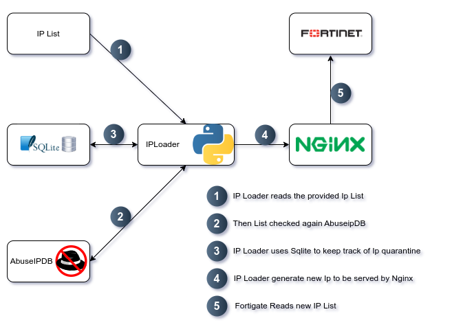

# IPloader

[](https://pypi.org/project/iploader/)


[](https://pepy.tech/project/iploader)

## 🛡️ Problem Overview

At our network edge, we used a **Fortigate firewall** to block malicious IPs reported daily—often hundreds addresses, suspected of hacking attempts. We faced several challenges:

1. **Hosting the Blocklist**  
Fortigate required the Bad-IP list to be hosted on a web server (e.g., Nginx) to import and apply it.

2. **IP Reputation Uncertainty**  
Not all IPs were confirmed threats. We needed to **verify them against AbuseIPDB** before blacklisting.

3. **No Auto-Expiration**  
Fortigate lacked **time-based blocking**—once blocked, IPs remained indefinitely unless manually removed.

## 🧩 Solution: IPloader

**IPloader** automates the process of validating, managing, and serving threat IP lists for Fortigate firewalls. It solves the challenges by:

- Validating IPs against **AbuseIPDB** to confirm threat reputation.
- Storing IPs in a **SQLite database** to prevent duplicates and manage expiration.
- Automatically **removing expired IPs** after a defined time.
- Serving the verified IP list via **Nginx** for Fortigate to import and block.
- Running as a **systemd timer** to update the list daily, with no manual effort.



## 📦 About IPloader

IPloader is a tool that checks a list of IPs against [AbuseIPDB](https://www.abuseipdb.com/) to determine which IPs are confirmed threats. It then prepares the list for use with Fortigate firewalls and handles IP expiration automatically.

## 🚀 Installation

Use `pip` to install IPloader:

```bash
pip3 install iploader
```
####⚙️ Configuration

Create a config.ini file in /opt/ with the following content:

```ini
[DEFAULT]
Description = IPloader
Version = 1.0

[conf]
Infile = /tmp/ip_list.txt
DBPath = /opt/data.db
Outfile = /var/www/html/ip.txt
ExpirationDays = 60
LogDest = /var/log/ip_loader.log
Token = <YOUR_ABUSEIPDB_TOKEN>
```
### Confing  Descriptions:

- **Infile**
  
CSV list of IPs to check against AbuseIPDB:

```bash
1.1.1.1
2.2.2.2
3.4.5.2
...
```
- **Outfile**
 File path where the validated IP list will be saved. This is server by webserve 

- **LogDest**
 File path for logging. All events are also displayed in the console.

- **ExpirationDays**
  Set to 0 to disable expiration. IPs will remain until manually removed.
  
- **DBPath**
  Location for the SQLite database.
  
 - **Token**
   Your ABUSEIPDB‌ API Token

  ### ⚙️How It Works
  
  IPloader reads IPs from the input file and checks each against AbuseIPDB.

  Valid IPs are stored in a SQLite database with a timestamp.

  On each run, it checks for expired IPs and removes them from the output list.

  To use expiration, schedule the script via cron or systemd to run daily.

  ### 🔧 Run as a Systemd Service

  **1.Create the service file:**
  ```bash
  sudo vim /lib/systemd/system/iploader.service
  ```
  ```ini
[Unit]
Description=IPloader Service

[Service]
Type=simple
ExecStart=/usr/local/bin/iploader
```

**2.Create the timer file:**
```bash
sudo vim /lib/systemd/system/iploader.timer
```
```ini
[Unit]
Description=Daily run for IPloader

[Timer]
OnCalendar=daily
RandomizedDelaySec=12h
Persistent=true

[Install]
WantedBy=timers.target
```
**3.Reload systemd and enable the timer:**
```bash
sudo systemctl daemon-reload
sudo systemctl enable --now iploader.timer
```
## 🤝 Contributing
Pull requests are welcome! For major changes, please open an issue first to discuss what you’d like to change.


